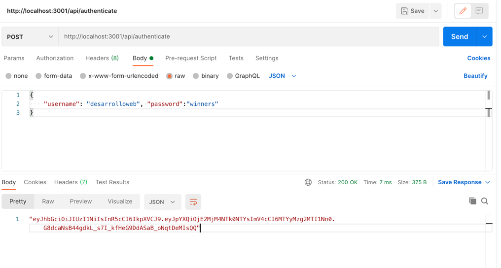
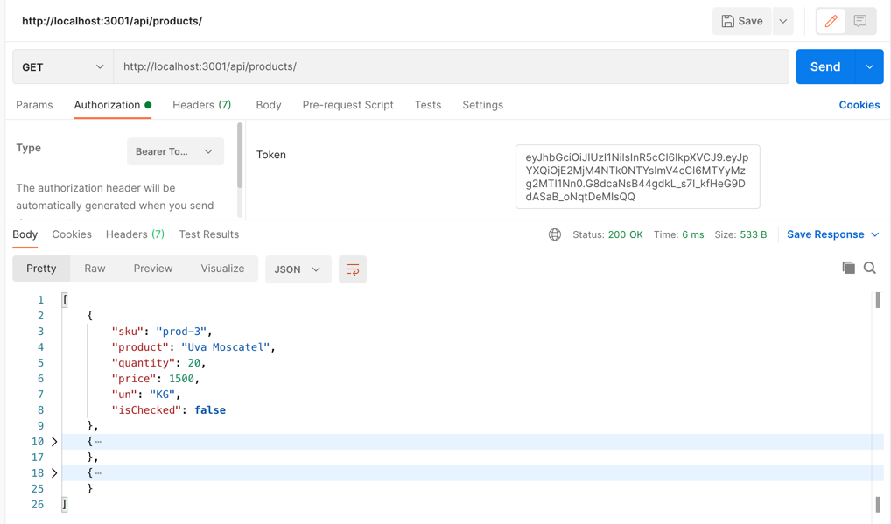

# fruit-store-serve
 Server for connection with APi fruit-store

#Steps
* npm install
* node index.js
* install Postman application

#Authorization

1.- use /api/authenticate endpoint and get token with username and password valid

Postman figure

2.- Copy token from body response

3.- Create a new Tab for get list from /api/products

4.- Go authorization tab, choose type Bearer and paste token on input

5.- click Send! enjoy

